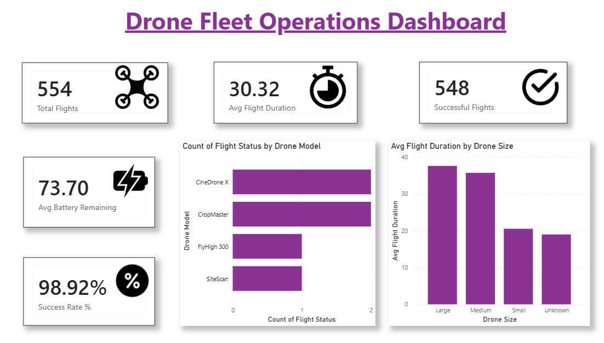

# Drone Fleet Operations Dashboard

A Power BI dashboard analyzing 554 drone flights across 25 drone models, built to surface operational insights like flight reliability, failure patterns, and performance differences by drone size.

## Dataset

Source: [Supplemental Drone Telemetry Data & Operations Log](https://www.kaggle.com/datasets/samsudeenashad/supplemental-drone-telemetry-data-and-operations-log) (Kaggle)

The raw dataset contained 557 flight records with fields including drone specs (model, size, manufacturer), flight metrics (altitude, duration, distance, battery, GPS accuracy), and operational details (payload, wind speed, obstacles, flight status).

## Data Cleaning (Power Query)

The raw data had several real-world inconsistencies that needed resolving before analysis:

- **Flight Status**: merged 5 inconsistent labels (Completed, Yes, Aborted, No, Landed Unexpectedly) into two clean categories: Success / Failed
- **Drone Size**: standardized into Small / Medium / Large / Unknown, correcting stray numeric entries that didn't belong in the column
- **Battery Remaining (%)**: fixed a column mistakenly imported as text (caused by 2 date-formatted entries mixed into a numeric field); converted to proper decimal type
- **Altitude (meters)**: removed 2 misplaced text values (payload/GPS descriptions that had leaked into the wrong column) and converted to numeric type
- Removed fully blank rows, reducing the dataset from 557 to 554 usable flight records

## Key Findings

- **Overall success rate: ~99%** (548 of 554 flights completed successfully)
- **Failures were concentrated in a small number of models** — CineDroneX and CropMaster accounted for 4 of the 6 total failed flights, with FlyHigh 300 and SiteScan each contributing 1
- **Drone size correlates with flight duration** — Large (37.6 min) and Medium (35.8 min) drones flew roughly 75% longer on average than Small drones (20.5 min), consistent with larger drones typically carrying larger batteries

## Dashboard Features

- KPI cards: Total Flights, Success Rate %, Avg Battery Remaining, Avg Flight Duration
- Failure breakdown by drone model
- Average flight duration by drone size

## Tools Used

Power BI (Power Query for cleaning, DAX for measures)

## Why This Project

Most beginner analytics portfolios use the same few datasets (HR attrition, retail sales, COVID stats). This project uses UAV/drone operations data instead, connecting to a hands-on drone systems background (FPV simulation and flight testing work) while applying the same core analytical techniques used in business analytics — data cleaning, KPI definition, and anomaly/failure pattern analysis — just applied to a less common domain.
